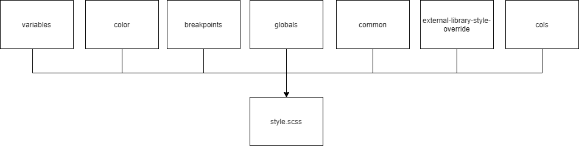
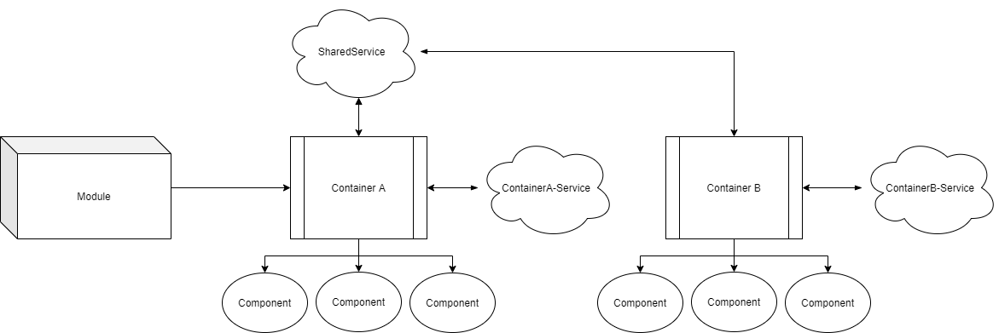

# Angular Boilerplate

The Angular Boilerplate is a set of rules and suggested framework that can be used to define a structure to an application. The defined structure can be used to achieve the following:

- Performance improvement in the following ways:
  - Reduced bundle size by organizing CSS in  a way that the styles common across components could be written on  a global level thus avoiding repetition and having bloated bundles.
  - Reduced bundle size by placing common TS code in assigned services, utils etc to thereby optimize the overall bundle. 
- Improved UX by implementing app-shell to display information to the user while the application fetches the data to be displayed on the UI.
- Better application management by setting out defined points of inputs for writing better CSS/TS.

The Boilerplate has the following features:

- Better Organised SCSS file structure

As per the file layout suggested in the image above, the roles that are illustrated are well laid out. Each filename corressponds to what they are responsible for and how sepration of concern and better code organization is achieved.

Also refer to the other [Readme](./src/app/sample-module/ReadMe.md) for more information about the POCs contained within this boilerplate.

For a more detailed presentation you can refer to the following location in [Microsoft Teams](https://teams.microsoft.com/_#/files/General?threadId=19%3A97618d79c54c4c718ff19cf4cdcca529%40thread.skype&ctx=channel&context=UI%2520Best%2520Practices&rootfolder=%252Fsites%252FXNETTechnicalKM%252FShared%2520Documents%252FGeneral%252FKnowledge%2520Sharing%2520Sessions%252FUI%2520Best%2520Practices).

## Contributors

Contributors | Email
-------------|------------
Sahil Thukral | sahil.thukral@soprasteria.com
Subroto Mukherjee | subroto.mukherjee@soprasteria.com
Rupesh Gupta | rupesh-kumar.gupta@soprasteria.com
Ankit Gupta | ankit.gupta2@soprasteria.com
Sumit Kumar | sumit.kumar2@soprasteria.com
Manish Kumar Soni | manish.kumar4@soprasteria.com

# Happy Coding 
:+1:
